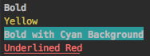
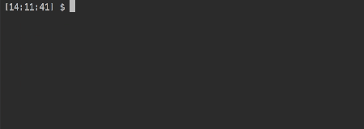

# pretty.cli

Clojure utilities to create amazing Command Line Interfaces

[](https://travis-ci.org/civa86/pretty.cli)
[](https://clojars.org/org.clojars.civa86/pretty.cli)

## Documentation

[API Documentation](https://civa86.github.io/pretty.cli/) 

## Examples

See it in action!

#### ANSI Escapes

ANSI Escapes codes for manipulating the terminal:<br/> 
clear the screen, move the cursor, delete lines and many more 

```clojure
(use 'pretty.cli.ansi-escapes)
(println "Here")
(println "First")
(println (cursor-up 2))
(println "Second")
(println (clear-screen))
```


#### Colors

Enrich your text with colors, background and styles 

```clojure
(use 'pretty.cli.colors)
(println (txt-bold "Bold"))
(println (yellow "Yellow"))
(println (cyan-bg (txt-bold "Bold with Cyan Background")))
(println (txt-underscore (red "Underlined Red")))
```



#### Figlet

Print ASCII banners on your terminal

```clojure
(use 'pretty.cli.figlet)
(println (figlet "Hello world"))
```


```clojure
(use 'pretty.cli.colors)
(use 'pretty.cli.figlet)
(println (yellow (figlet "STAR" "starwars")))
(println (cyan (figlet "WARS" "starwars")))
```


#### Prompt User Input

Ask user input with many possibilities:<br/>
free input with validation, confirmation, select list and checkbox options

```clojure
(use 'pretty.cli.prompt)
(input "What's your name" (fn [x] (if (= "" x) "Sorry?")))
(list-select "Choose your meal" ["Pasta" "Pizza" "Hamburger" "Salad"])
(list-checkbox "Add toppings" ["Bacon" "Cheese" "Onions" "Eggs"])
(confirm "Are you sure")
```



## License

MIT.
